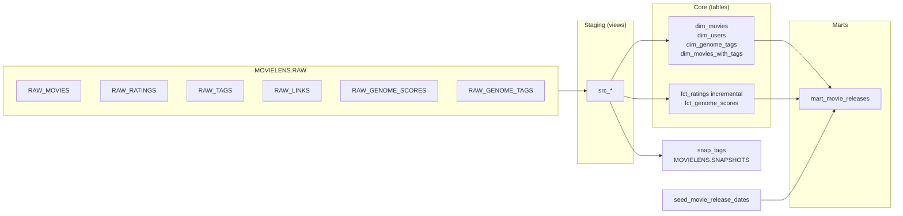

# MovieLens dbt Pipeline on Snowflake

A dbt Core project that models the [MovieLens 20M](https://grouplens.org/datasets/movielens/20m/) dataset into a dimensional (Kimball-style) warehouse on Snowflake. It covers layered transformations, an incremental fact table, an SCD Type 2 snapshot, and schema and singular tests.


## Contents

- [Scope](#scope)
- [Architecture](#architecture)
- [Model layers](#model-layers)
- [Design decisions](#design-decisions)
- [Testing](#testing)
- [Setup](#setup)
- [Loading raw data](#loading-raw-data)
- [Running the project](#running-the-project)
- [Repository layout](#repository-layout)
- [Known limitations and roadmap](#known-limitations-and-roadmap)

## Scope

| Item | Detail |
|---|---|
| Source | MovieLens 20M (GroupLens): movies, ratings, tags, links, genome scores, genome tags |
| Volume | ~20M rating rows, ~11.7M genome score rows |
| Warehouse | Snowflake, `MOVIELENS` database |
| Transformation | dbt Core, `dbt-snowflake`, `dbt_utils` |
| Materializations | views (staging), tables (dimensions, marts), incremental (`fct_ratings`), snapshot |

The project is a portfolio and reference implementation. It does not include an orchestrator or CI (see [roadmap](#known-limitations-and-roadmap)).

## Architecture



Everything outside `RAW` is built by dbt. Snapshots write to a separate schema so history is isolated from rebuildable models.

## Model layers

| Layer | Path | Materialization | Purpose |
|---|---|---|---|
| Staging | `models/staging/` | view | 1:1 with raw tables: rename to snake_case, cast types, convert epoch to timestamp, filter invalid rows |
| Dimensions | `models/dim/` | table | `dim_movies`, `dim_users`, `dim_genome_tags`, and `dim_movies_with_tags` (movie grain, tags aggregated) |
| Facts | `models/fct/` | table / incremental | `fct_ratings` (user x movie rating events), `fct_genome_scores` (movie x tag relevance) |
| Marts | `models/mart/` | table | `mart_movie_releases`: rating aggregates joined to release dates from the seed |
| Snapshots | `snapshots/` | snapshot | `snap_tags`: SCD Type 2 history |
| Seeds | `seeds/` | seed | `seed_movie_release_dates`: static reference data |

## Design decisions

### Incremental ratings fact

`fct_ratings` is incremental with `unique_key = ['user_id', 'movie_id']`, so Snowflake uses the default `merge` strategy. New rows are selected by watermark:

```sql
{{ config(
    materialized = 'incremental',
    unique_key   = ['user_id', 'movie_id']
) }}

select *
from {{ ref('src_ratings') }}

where rating_timestamp > (select max(rating_timestamp) from {{ this }})

```

Trade-offs:

- A strict `>` on `max(rating_timestamp)` skips late-arriving rows older than the current watermark, and rows sharing the boundary timestamp that were not yet loaded. Acceptable for a static dataset; for a live feed use a lookback window (`>= max - interval`) and rely on the merge key for idempotency.
- Because the unique key is `(user_id, movie_id)`, a re-rating overwrites the prior row and history is not retained in the fact.
- Use `dbt run --full-refresh -s fct_ratings` after any change to upstream logic.

### Dimensional model

Facts hold measures and foreign keys; descriptive attributes live in dimensions. Natural keys from MovieLens (`movie_id`, `user_id`, `tag_id`) are stable and unique, so they are used as join keys. Movie genres are pipe-delimited in the source and parsed in `dim_movies`.

### SCD Type 2 snapshot

`snap_tags` uses the `timestamp` strategy and writes `dbt_scd_id`, `dbt_valid_from`, and `dbt_valid_to`; current rows have `dbt_valid_to is null`.

MovieLens tags are immutable user events, so this snapshot demonstrates the mechanism rather than capturing meaningful attribute changes. On a source with mutable attributes and a reliable `updated_at`, the same pattern applies unchanged.

### Schema layout

All dbt models currently build into `MOVIELENS.DEV`; snapshots build into `MOVIELENS.SNAPSHOTS`; raw data sits in `MOVIELENS.RAW`.

## Testing

| Type | Location | Coverage |
|---|---|---|
| Generic | `models/schema.yml` | `not_null` and `unique` on primary keys (`movie_id`, `tag_id`); `relationships` from `fct_ratings.movie_id` to `dim_movies.movie_id` |
| Singular | `tests/relevance_score_test.sql` | Fails if any genome `relevance` value is less than or equal to 0 |

Run all tests, plus models, seeds, and snapshots in dependency order, with `dbt build`.

## Setup

### Requirements

- Python 3.9 or newer (check the dbt-snowflake release you install for its supported versions)
- A Snowflake account with a role that can create objects in `MOVIELENS`

### Install

```bash
git clone https://github.com/AbdulWahabJhare/netflix_snowflake_dbt.git
cd netflix_snowflake_dbt

python -m venv .venv
source .venv/bin/activate        # Windows: .venv\Scripts\activate
pip install dbt-snowflake
dbt deps
```

### Snowflake role and warehouse

Use a dedicated role instead of `ACCOUNTADMIN`:

```sql
use role securityadmin;
create role if not exists dbt_role;

use role sysadmin;
create warehouse if not exists compute_wh
  warehouse_size = 'XSMALL' auto_suspend = 60 auto_resume = true;
create database if not exists movielens;

grant usage on warehouse compute_wh to role dbt_role;
grant all on database movielens to role dbt_role;
grant role dbt_role to user <your_user>;
```

### Connection profile

Credentials should come from environment variables, never from committed files. `~/.dbt/profiles.yml`:

```yaml
netflix_dbt:
  target: dev
  outputs:
    dev:
      type: snowflake
      account:   "{{ env_var('SNOWFLAKE_ACCOUNT') }}"
      user:      "{{ env_var('SNOWFLAKE_USER') }}"
      password:  "{{ env_var('SNOWFLAKE_PASSWORD') }}"
      role:      dbt_role
      warehouse: compute_wh
      database:  movielens
      schema:    dev
      threads:   4
```

Check that the profile name matches the `profile:` key in `dbt_project.yml`, then run `dbt debug`.

## Loading raw data

dbt handles only the transformation step. Raw tables in `MOVIELENS.RAW` are loaded from the MovieLens 20M CSV files:

```sql
create schema if not exists movielens.raw;

create file format if not exists movielens.raw.csv_ff
  type = csv skip_header = 1 field_optionally_enclosed_by = '"';

create stage if not exists movielens.raw.movielens_stage
  file_format = movielens.raw.csv_ff;

-- Upload the CSVs first, for example with SnowSQL:
--   PUT file:///path/to/ml-20m/*.csv @movielens.raw.movielens_stage;

-- Example for one table (repeat for each file with its own DDL):
create or replace table movielens.raw.raw_ratings (
  userid    integer,
  movieid   integer,
  rating    float,
  timestamp integer
);

copy into movielens.raw.raw_ratings
from @movielens.raw.movielens_stage/ratings.csv;
```

Adjust column names and types to match your staging models.

## Running the project

```bash
dbt debug                # validate connection
dbt deps                 # install dbt_utils
dbt build                # seeds, models, snapshots, and tests in DAG order

dbt docs generate
dbt docs serve           # lineage graph and column docs
```

Common selectors:

```bash
dbt build -s +mart_movie_releases          # a mart and everything upstream
dbt run   -s fct_ratings                   # incremental run
dbt run   -s fct_ratings --full-refresh    # rebuild the fact
dbt test  -s fct_ratings
```

## Repository layout

```text
netflix_dbt/
├── analyses/                     # ad-hoc queries
├── macros/                       # reusable Jinja
├── models/
│   ├── staging/                  # src_* views
│   ├── dim/                      # dimensions
│   ├── fct/                      # facts
│   ├── mart/                     # reporting models
│   └── schema.yml                # docs and tests
├── seeds/
│   └── seed_movie_release_dates.csv
├── snapshots/
│   └── snap_tags.sql
├── tests/
│   └── relevance_score_test.sql
├── dbt_project.yml
└── packages.yml
```

## Known limitations and roadmap

- Single `DEV` schema and no `prod` target. Planned: per-layer schemas via `generate_schema_name` and a separate prod target.
- Staging models use the `src_` prefix. Planned: rename to `stg_` and declare `RAW` tables in `sources.yml` with freshness checks.
- Incremental watermark does not handle late-arriving data (see [design decisions](#incremental-ratings-fact)).
- Test coverage is minimal. Planned: rating range (0.5 to 5.0 in 0.5 steps), `accepted_values` where applicable, and `dbt_utils` expression tests on facts.
- No CI. Planned: GitHub Actions running `dbt build` against a slim CI schema on pull requests.
- No orchestration. The run order is manual.

## License

MIT. See `LICENSE`.